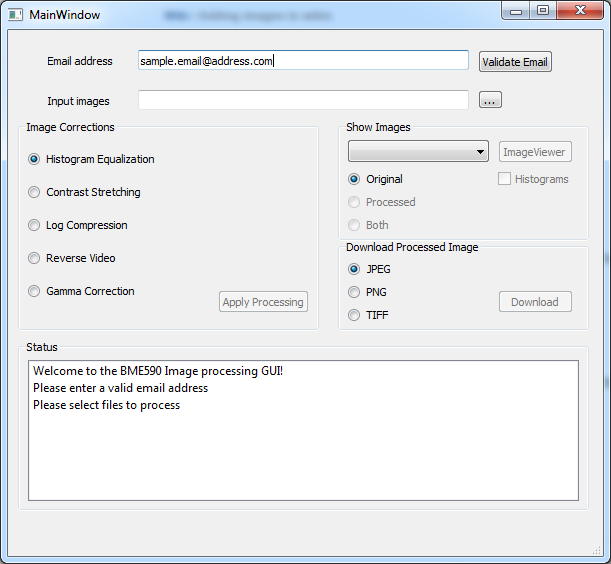
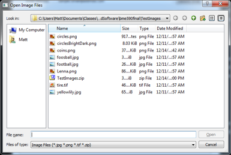
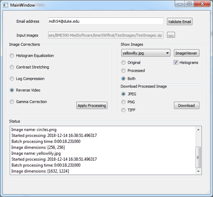
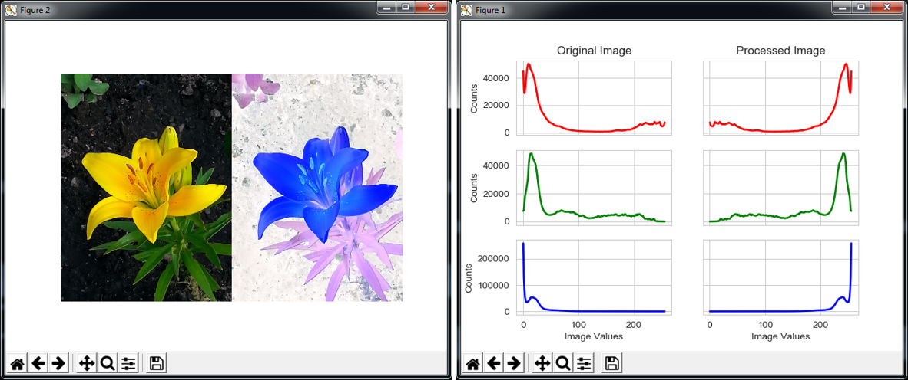

# Image Processor Final Project
## BME590 - Medcial Software Design
Authors: Matt Holbrook, Alan Register, Alex Guevara

### General information
Welcom to our final project for BME590! This project represents simple a 
cloud-based image processing platform. This 
includes a graphical user interface, or GUI, in which a user can specify 
images and processing methods and a server endpoint which performs all of the 
processing. Processed images are returned to the user to view and download.

## About the GUI
The user interface was constructed using [PyQt5](https://www.riverbankcomputing.com/software/pyqt/intro)
. It allows the user to select images, processing methods, view the original 
and processed images, and download processed images in a variety of 
formats. The main page of the GUI is shown below:

The GUI can be accessed by running `frontEndGUI.py` in the main project 
directory.

### Email address
The before any options become avaliable the GUI asks for your email address. 
The address must be validated before other options become available. Your 
information is used only as a user identifier and is not shared with outside 
parties.

### Input images
Single and sets of images, including zip files containing images, can be 
loaded into the program using the button labeled `...`. This will bring up 
the following dialog box:

Images will be loaded into memory after the user clicks `Open`. The GUI field 
titled `Input images` cannot be edited by the user, but will be updated to show 
the first image selected by the user.

### Processing images
For this project, a set of 5 image processing tasks are available:
* Histogram equalization
* Contrast stretching
* Log compression
* Reverse video
* Gamma correction

Each of these are relatively simple transforms which alter the contrast of 
the image. These work on both RGB and black-and-white images.

__Note__: histogram equalization usually only works on black-and-white 
images. 
>Histogram equalization is a non-linear process. Channel splitting and equalizing each channel separately is incorrect. Equalization involves intensity values of the image, not the color components. So for a simple RGB color image, histogram equalization cannot be applied directly on the channels. It needs to be applied in such a way that the intensity values are equalized without disturbing the color balance of the image.

From https://prateekvjoshi.com/2013/11/22/histogram-equalization-of-rgb-images/:

Here we have overcome this limitation by changing RGB images into images 
which can be histogram equalized. We have used OpenCV to convert RBG imges to 
luminescence, blue difference and
 ref difference (YCbCr). We have then performed histogram equalization on 
 only the luninescence channel before recombining the image back to GB.
 
 The GUI will wait until the prcessing on the server has completed before 
 allowing further actions.
 
 ### Viewing the images
 Processed images will be shown in a drop down menu. These can be selected to
  choose which image to view. Options are available for showing the original,
   processed, or both images. Histograms will also be displayed if the 
   `Histograms` box is checked.

The image will launch in your system's image viewer. You may be prompted to 
select the viewer before seing the image appear. If the `Both` option is 
selected the original and processed images will appear side-by-side, on the 
left and right respectively. The images histograms will appear as a separate 
[Matplotlib](https://matplotlib.org/) plot. In the example below the image 
has been treated with `reverse video` processing.

### Downloading images
Images can be downloaded in the format of your choice by selecting the format
 radiobutton (`JPEG`, `PNG`, or `TIFF`) and clicking `Download`. The dialog 
 box brought up here will recommend a download location and name based on the
  names of the input files. If more than one files were loaded into the 
  program the, all images will download at once, and save options will be 
  limited to zip format. A zip file of 
  processed images in the format specified by the radio buttons will be 
  downloaded and saved to disk.
  
  
  ## About the server
  The server uses a RESTful API which provides interactions with the local 
  GUI client via a web service. The local GUI posts to `/new_user` which 
  handles all following requests. Images are encoded using base64 and sent 
  via this mechanism. The images are decoded, processed, encoded, before 
  being sent back to the GUI for viewing/downloading. This server is 
  currently running at `http://vcm-7304.vm.duke.edu:5000`. In the release of 
  this software the GUI will point to this address.

