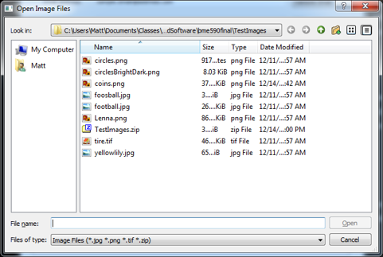

# Image Processor Final Project
## BME590 - Medcial Software Design
Authors: Matt Holbrook, Alan Register, Alex Guevara

### General information
Welcom to our final project for BME590! This project represents simple a 
cloud-based image processing platform. This 
includes a graphical user interface, or GUI, in which a user can specify 
images and processing methods and a server endpoint which performs all of the 
processing. Processed images are returned to the user to view and download.

## About the GUI
The user interface was constructed using [PyQt5](https://www.riverbankcomputing.com/software/pyqt/intro)
. It allows the user to select images, processing methods, view the original 
and processed images, and download processed images in a variety of 
formats. The main page of the GUI is shown below:

The GUI can be accessed by running `frontEndGUI.py` in the main project 
directory.

### Email address
The before any options become avaliable the GUI asks for your email address. 
The address must be validated before other options become available. Your 
information is used only as a user identifier and is not shared with outside 
parties.

### Input images
Single and sets of images, including zip files containing images, can be 
loaded into the program using the button labeled `...`. This will bring up 
the following dialog box:

Images will be loaded into memory once they have been selected. The field 
titled `Input images` will be updated to show the first image selected.

